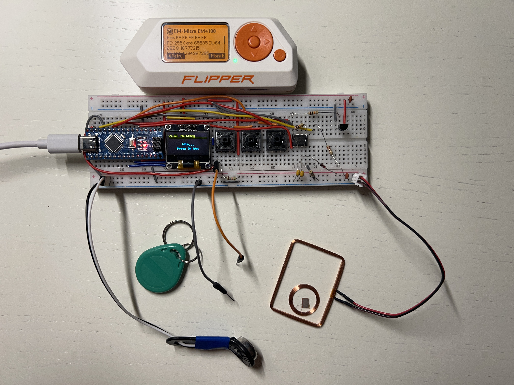
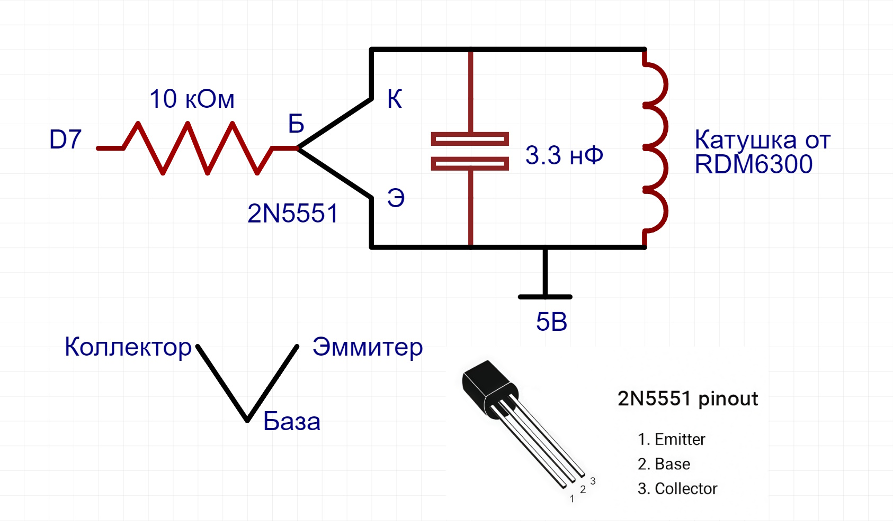
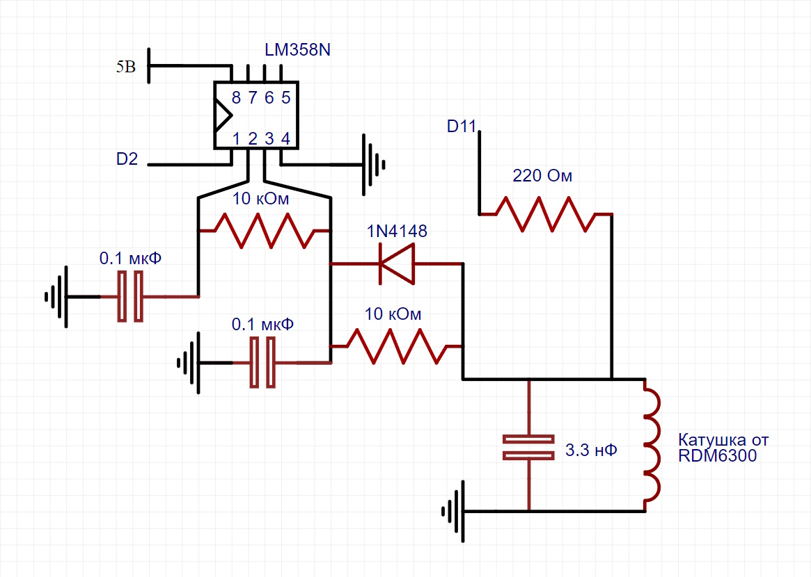
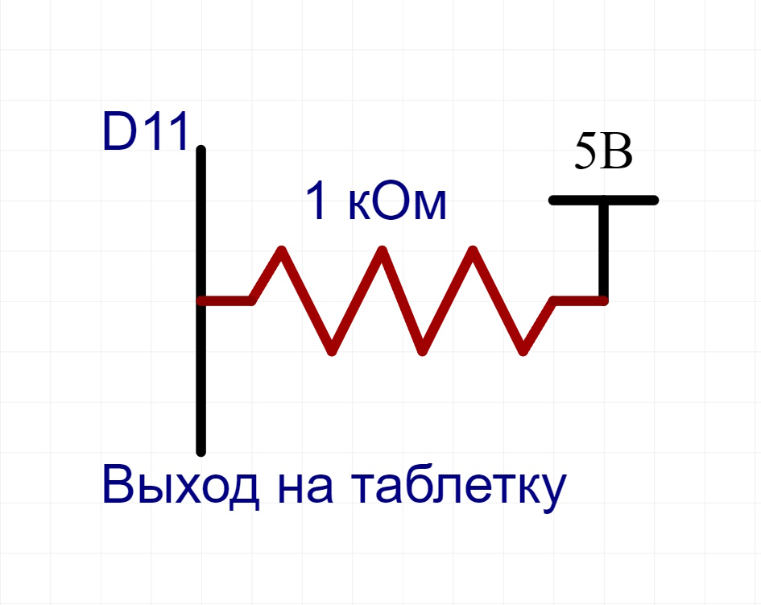

# MultiKey
<p>
    
</p>

### Структура функций

```text
Main Menu/
├── RFID/
│   ├── Read - чтение RFID
│   ├── Write - запись на болванки T5577 
│   └── Emulate - эмуляция ключей 
├── iButton/
│   ├── Read - чтение ключей Dallas (DS1990)
│   ├── Write - запись на болванки RW1990
│   └── Emulate - эмуляция таблеток
└── Utils/
    ├── Clear EEPROM - очистить все ключи в памяти
    ├── Clear RFID keys - очистить только ключи RFID
    └── Clear iBut keys - очистить только таблетки iButton
```
### Список компонентов:

- Микроконтроллер Arduino Nano
- Дисплей OLED 0.96 128x64
- 3 кнопки
- 3 резистора на 10 кОм
- 1 резистор на 1 кОм (Желательно 2.2 кОм или 4.7 кОм)
- 1 резистор на 220 Ом
- 2 конденсатора на 3.3 нФ (332)
- 2 конденсатора на 0.1 мкФ (104)
- 1 транзитор 2N5551
- 1 операционный усилитель LM358N
- 2 колебательных контура от RDM6300 (Для 125кГц нужен конденсатор на 3.3нФ)

### Распиновка:
- D2 вход с усилителя (1 нога) для чтения RFID
- D7 выход на антенну для эмуляции RFID
- D11 выход для записи RFID
- D4 Кнопка вверх
- D3 Кнопка ОК
- D8 Кнопка вниз
- D10 выход на эмуляцию iButton 
- D12 выход на чтение/запись iButton
- A4 OLED SDA
- A5 OLED SCL


### Схема подключения:

RFID Emulation:
<p>
    
</p>

Эмуляцию RFID я позаимствовал у [dlinyj](https://habr.com/ru/companies/ruvds/articles/533474/)

RFID Read/Write:
<p>
    
</p>

iButton Emulation:  
Пин D10

iButton Read/Write:
<p>
    
</p>
Желательно использовать резистор на 2.2 кОм или 4.7 кОм

Библиотеки:

- Wire - для общения с дисплеем по шине I2C
- U8g2lib - для дисплея  
- OneWireHub, OneWire и DS2401 - для iButton  
- EEPROM - для памяти  
- avr/pgmspace - для flash памяти

  